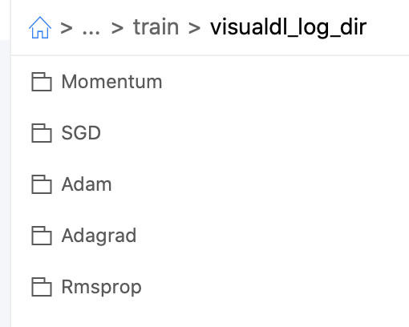
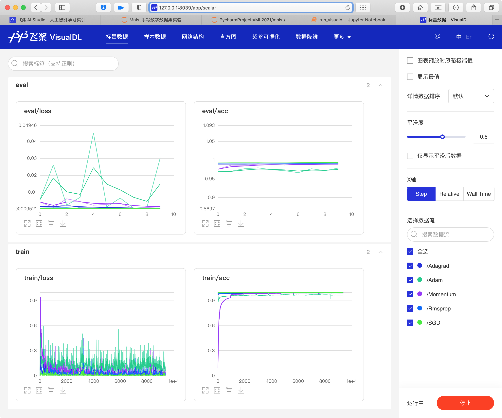
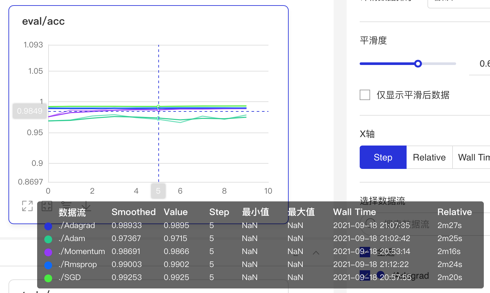

# 作业2：Mnist手写数字数据集实验

# 任务一：搭建自己的神经网络MyNet()

定义多层卷积神经网络：

```Python
# 定义多层卷积神经网络
#动态图定义多层卷积神经网络
class MyNet(paddle.nn.Layer):
    def __init__(self):
        super(MyNet, self).__init__()
        self.conv1 = paddle.nn.Conv2D(in_channels=1, out_channels=6, kernel_size=5, stride=1, padding=2)
        self.max_pool1 = paddle.nn.MaxPool2D(kernel_size=2,  stride=2)
        self.conv2 = paddle.nn.Conv2D(in_channels=6, out_channels=16, kernel_size=5, stride=1)
        self.max_pool2 = paddle.nn.MaxPool2D(kernel_size=2, stride=2)
        self.linear1 = paddle.nn.Linear(in_features=16*6*6, out_features=120)
        self.linear2 = paddle.nn.Linear(in_features=120, out_features=84)
        self.linear3 = paddle.nn.Linear(in_features=84, out_features=10)
        
    def forward(self, x):
        x = self.conv1(x)
        x = F.relu(x)
        x = self.max_pool1(x)
        x = F.relu(x)
        x = self.conv2(x)
        x = self.max_pool2(x)
        x = paddle.flatten(x, start_axis=1,stop_axis=-1)
        x = self.linear1(x)
        x = F.relu(x)
        x = self.linear2(x)
        x = F.relu(x)
        x = self.linear3(x)
        return x

```


可视化结果：

```Python
---------------------------------------------------------------------------
 Layer (type)       Input Shape          Output Shape         Param #    
===========================================================================
   Conv2D-9       [[1, 1, 32, 32]]      [1, 6, 32, 32]          156      
  MaxPool2D-9     [[1, 6, 32, 32]]      [1, 6, 16, 16]           0       
   Conv2D-10      [[1, 6, 16, 16]]     [1, 16, 12, 12]         2,416     
 MaxPool2D-10    [[1, 16, 12, 12]]      [1, 16, 6, 6]            0       
   Linear-13         [[1, 576]]            [1, 120]           69,240     
   Linear-14         [[1, 120]]            [1, 84]            10,164     
   Linear-15         [[1, 84]]             [1, 10]              850      
===========================================================================

```


# 任务二：采用不同的优化方法并展示验证集的acc/loss曲线

## 2.1创建、训练不同优化方法的模型

包括SGD/Momentum/Adam/Adagrad/Rmsprop优化方法，使用VisualDL可视化。

**以采用Momentum优化方法为例：** 

依次经过 封装模型→定义优化方法→配置模型→定义callback设置可视化log保存地址→使用fit()方法训练模型。

```Python
# 用Model封装模型
model_Momentum = paddle.Model(net_cls)

# 定义优化方法
optim = paddle.optimizer.Momentum(learning_rate=lr, parameters=model_Momentum.parameters(), momentum=momentum)

# 配置模型
model_Momentum.prepare(optim,paddle.nn.CrossEntropyLoss(),Accuracy())

# 设置callback，训练完成后将可视化log保存到指定文件夹
callback = paddle.callbacks.VisualDL(log_dir='./log/train/visualdl_log_dir/Momentum')

# 训练
model_Momentum.fit(
    train_dataset,
    test_dataset,
    epochs=epochs,
    batch_size=batch_size,
    verbose=1,
    callbacks = callback
)
```


依次创建5个使用不同优化方法的模型，训练并最终得到各自VisualDL的可视化log文件（每个文件夹内有对应的一份log文件）：



## 2.2编写Python脚本启动VisualDL面板

将以上文件夹下载到本地，然后运行以下脚本：

```Python
import paddle
from visualdl.server import app

logdir = ['./Adagrad','./Adam','./Momentum','./Rmsprop','./SGD']

app.run(
    logdir,
    port = 8039,
)
```


打开[http://127.0.0.1:8039/](http://127.0.0.1:8039/)，可以查看可视化结果：



测试集准确率中可以看出，使用`SGD`优化方法的模型整体表现最好。




