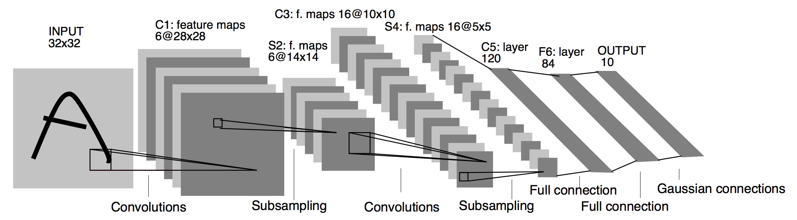
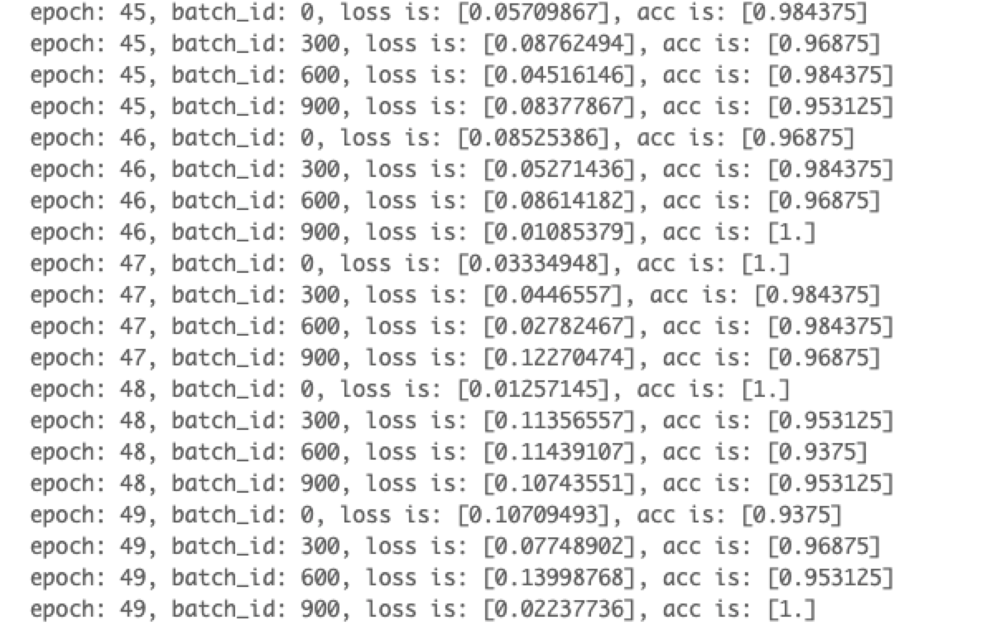
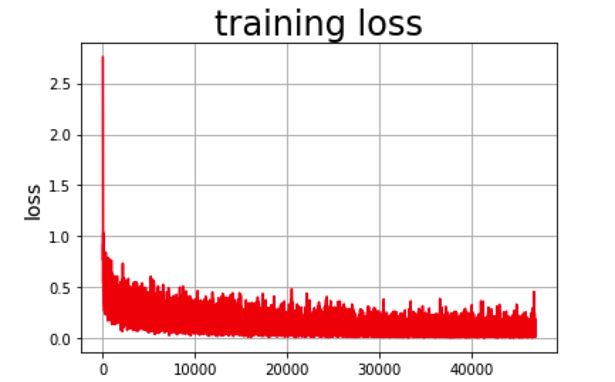
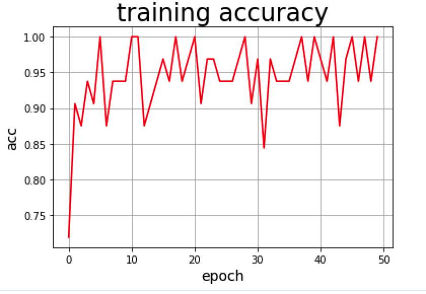
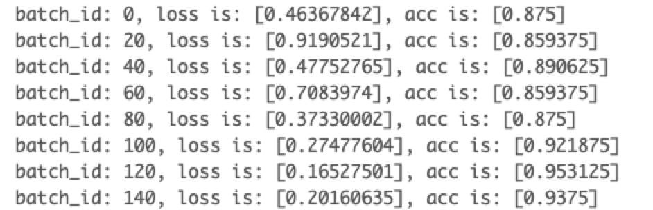
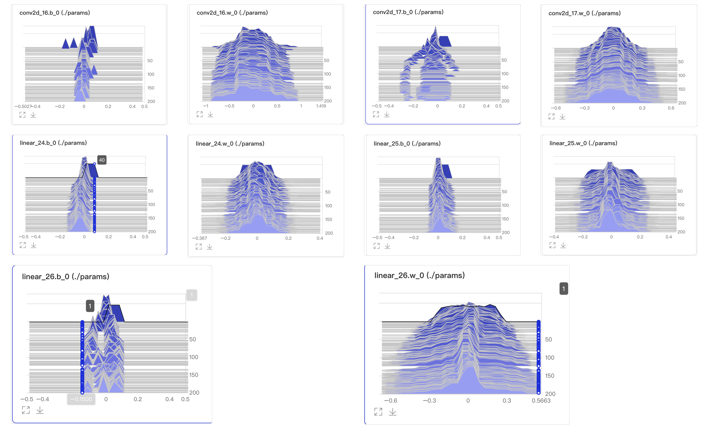

# 作业3：Fashion Mnist实现图像分类

# 任务一：使用卷积神经网络完成Fashion-MNIST的分类任务。

## 1.1LeNet的结构图以及代码实现



LeNet分为卷积块和全连接层块两个部分，

1. 在卷积块中，每个卷积层都使用5x5的窗口，并在输出上使用ReLU激活函数。

2. 第一个卷积层的输出通道数为6，第二个卷积层的输出通道数为16。

3. 卷积层的两个最大池化层的窗口形状都为2x2，且步幅为2，最大池化层输出的宽和高都减半。

```Python
import paddle.nn.functional as F
import paddle.nn as nn
class LeNet(paddle.nn.Layer):
    def __init__(self):
        super(LeNet, self).__init__()
        # 搭建网络
        self.conv1 = nn.Conv2D(in_channels=1,out_channels=6,kernel_size=5,stride=1,padding=2)
        self.max_pool1 = nn.MaxPool2D(kernel_size=2,stride=2)
        self.conv2 = nn.Conv2D(in_channels=6,out_channels=16,kernel_size=5,stride=1)
        self.max_pool2 = nn.MaxPool2D(kernel_size=2,stride=2)
        self.linear1 = nn.Linear(in_features=16*5*5,out_features=120)
        self.linear2 = nn.Linear(in_features=120,out_features=84)
        self.linear3 = nn.Linear(in_features=84,out_features=10)
    
    def forward(self, x):
        x = self.conv1(x)
        x = F.relu(x)
        x = self.max_pool1(x)
        x = F.relu(x)
        x = self.conv2(x)
        x = self.max_pool2(x)
        x = paddle.flatten(x, start_axis=1 , stop_axis=-1) # [16,5,5] -> [16*5*5]
        x = self.linear1(x)
        x = F.relu(x)
        x = self.linear2(x)
        x = F.relu(x)
        x = self.linear3(x)
        return x

```


# 任务二：在README文件中描述所使用的模型的结构、优化器、损失函数和超参数等信息，以及模型在训练集和测试集上的最优结果。

## 2.1模型参数可视化：

```Python

#模型网络结构可视化
leNet = LeNet()
paddle.summary(leNet, (-1, 1, 28, 28))

---------------------------------------------------------------------------
 Layer (type)       Input Shape          Output Shape         Param #    
===========================================================================
   Conv2D-1       [[1, 1, 28, 28]]      [1, 6, 28, 28]          156      
  MaxPool2D-1     [[1, 6, 28, 28]]      [1, 6, 14, 14]           0       
   Conv2D-2       [[1, 6, 14, 14]]     [1, 16, 10, 10]         2,416     
  MaxPool2D-2    [[1, 16, 10, 10]]      [1, 16, 5, 5]            0       
   Linear-1          [[1, 400]]            [1, 120]           48,120     
   Linear-2          [[1, 120]]            [1, 84]            10,164     
   Linear-3          [[1, 84]]             [1, 10]              850      
===========================================================================
Total params: 61,706
Trainable params: 61,706
Non-trainable params: 0
---------------------------------------------------------------------------
Input size (MB): 0.00
Forward/backward pass size (MB): 0.06
Params size (MB): 0.24
Estimated Total Size (MB): 0.30
---------------------------------------------------------------------------

{'total_params': 61706, 'trainable_params': 61706}

```


## 2.2优化器、损失函数和超参数等信息

1. 优化器：Adam，学习率0.001，权重衰减$5e^{-4}$

2. 损失函数：交叉熵损失

3. epoch：50

4. batchSize：64

模型的训练函数的实现代码如下：

1. 每个batch记录一次损失

2. 每300个batch记录一次模型参数变化

3. 每个epoch记录一次训练集准确率

```Python
train_loader = paddle.io.DataLoader(train_dataset, batch_size=64, shuffle=True)
# 加载训练集 batch_size 设为 64
train_loss_arr = []
acc_arr = []
def train(model):
    with LogWriter(logdir='./log/train') as writer:
        model.train()
        epochs = num_epochs
        optim = paddle.optimizer.Adam(learning_rate=learning_rate, parameters=model.parameters(),weight_decay=weight_decay)
        loss = 0
        acc = 0
        Batch = 0

        param = model.parameters()
        params_name = [param.name for param in model.parameters()]

        # 用Adam作为优化函数
        for epoch in range(epochs):
            for batch_id, data in enumerate(train_loader()):
                x_data = data[0]
                y_data = data[1]
                predicts = model(x_data)
                loss = F.cross_entropy(predicts, y_data)
                train_loss_arr.append(loss[0].item())
                # 计算损失
                acc = paddle.metric.accuracy(predicts, y_data)
                loss.backward()
                if batch_id % 300 == 0:
                    Batch += 1
                    # histogram组件
                    for name_i in range(len(params_name)):
                        writer.add_histogram(tag=params_name[name_i], values=param[name_i].numpy(), step=Batch)
                    
                    print("epoch: {}, batch_id: {}, loss is: {}, acc is: {}".format(epoch, batch_id, loss.numpy(), acc.numpy()))
                optim.step()
                optim.clear_grad()
            acc_arr.append(acc.numpy())
```


# 任务三：最终结果以及训练过程损失函数的变化趋势可视化

## 3.1训练过程中的损失以及准确率变化

一共训练50个epoch，最后5次epoch的训练集损失以及训练集准确率如图1所示：



整个训练过程的训练集损失和训练集准确率分别如图2，图3所示：最终训练集准确率在95%左右。




## 3.2测试集结果




最终测试集上的损失以及准确率如下图所示：



## 3.3参数的分布随训练批次的变化趋势

训练过程中，LeNet各层网络参数的变化如下所示：



